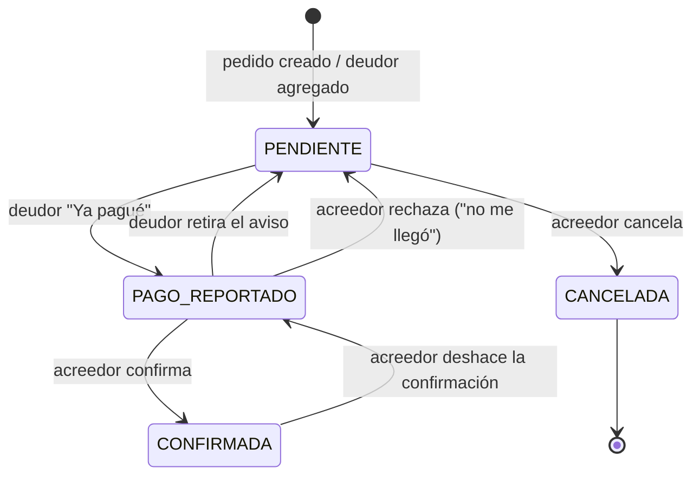

# Fino — SPEC de lógica de negocio

> Fino: llevar las cuentas de quién le debe qué a quién dentro de un grupo. **Fino no mueve dinero**: solo registra, notifica y da seguimiento. El pago real ocurre fuera de la app (transferencia o depósito).

Este documento define **solo negocio**: conceptos, reglas, estados, flujos, notificaciones y casos borde. Nada de stack técnico.

---

## 1. Principios

1. **Todo cuelga de un Pedido.** Una deuda nunca existe sola; siempre pertenece a un pedido. Un pago agrupado es solo un "sobre" que junta deudas de varios pedidos; no las reemplaza.
2. **Una deuda = una relación dirigida** (deudor → acreedor) por un monto. Nada de saldos globales mágicos ni compensaciones automáticas.
3. **El acreedor es quien confirma.** El deudor solo *declara* que pagó; la deuda se cierra cuando el acreedor lo confirma.
4. **Flexibilidad al repartir, rigor al cerrar.** Repartir un gasto es libre (automático, ajustado o manual); una vez que hay dinero de por medio, las deudas se congelan.
5. **Cada cambio relevante deja rastro** (bitácora) y notifica a la contraparte, nunca al que hizo la acción.
6. **Transparencia dentro del equipo, acción solo para los involucrados.** Todos los miembros pueden *ver* las deudas del equipo; solo el acreedor y el deudor de cada una pueden *actuar* sobre ella.

---

## 2. Glosario

| Término | Significado |
|---|---|
| **Usuario** | Persona autenticada con Google. Nombre y foto vienen de Google (no editables en Fino). |
| **Equipo** | Grupo cerrado de usuarios que se unen por código de invitación. |
| **Miembro** | Usuario dentro de un equipo. |
| **Método de cobro** | CLABE **o** tarjeta + banco que un miembro configura *por equipo* para recibir pagos. |
| **Pedido** | Registro de un gasto pagado por un miembro (el **acreedor**) que otros le deben repartido. |
| **Acreedor** | Quien pagó el gasto y registra el pedido. Es quien recibe el dinero. |
| **Deudor** | Miembro que le debe una parte al acreedor en un pedido. |
| **Deuda** | Parte de un pedido asignada a un deudor. Tiene su propio estado. |
| **Pago** | Aviso de "Ya pagué" de un deudor que cubre **una o varias** deudas con el mismo acreedor. |
| **Aviso** | Mensaje (recordatorio o texto libre) que el acreedor envía a otros miembros. |
| **Bitácora** | Historial inmutable de eventos de un pedido. |

---

## 3. Usuarios

- **U1.** El acceso es solo con cuenta de Google. No hay registro propio ni contraseñas.
- **U2.** Nombre y foto se toman de Google y se refrescan; el usuario no puede subir ni cambiar foto.
- **U3.** Si la cuenta de Google no tiene foto, se asigna un **avatar generado** (iniciales + color), determinístico por usuario (siempre el mismo).
- **U4.** Un usuario puede pertenecer a **varios equipos** y su actividad en cada uno es independiente.
- **U5.** La moneda es única: **MXN**. Los montos se manejan en centavos enteros (nunca decimales flotantes).

---

## 4. Equipos

### 4.1 Reglas

- **E1.** Cualquier usuario puede crear un equipo; el creador queda como **admin**.
- **E2.** Un equipo tiene un **código de invitación**. Quien lo ingrese se une como miembro. No hay límite fijo de miembros (N).
- **E3.** El admin puede **regenerar el código**; el anterior deja de funcionar de inmediato. Quien ya es miembro no se ve afectado.
- **E4.** Un usuario no puede unirse dos veces al mismo equipo (el código sobre un equipo donde ya está solo lo lleva al equipo).
- **E5.** Roles: **admin** (invita/regenera código, expulsa miembros, transfiere admin, elimina el equipo) y **miembro**. Todo lo demás (pedidos, deudas) es igual para todos.
- **E6.** Un equipo siempre tiene al menos un admin. Si el admin quiere salirse, primero **transfiere** el rol a otro miembro; si es el único miembro, elimina el equipo.

### 4.2 Salir, expulsar y eliminar — la regla de las deudas vivas

Una **deuda viva** es una en estado `PENDIENTE` o `PAGO_REPORTADO`.

| Acción | Condición |
|---|---|
| Salir del equipo | El usuario **no** tiene deudas vivas (ni como deudor ni como acreedor) en ese equipo. |
| Expulsar a un miembro (admin) | El miembro **no** tiene deudas vivas en ese equipo. |
| Eliminar el equipo (admin) | **Ninguna** deuda viva en todo el equipo. |

Si hay deudas vivas, la app lo bloquea y muestra cuáles hay que resolver (pagar, confirmar o cancelar). Así nadie "se escapa" de una deuda ni deja a alguien sin cobrar.

Tras salir, el historial se conserva para los demás (con el nombre y avatar del usuario que salió). Si el deudor de una deuda `CONFIRMADA` ya salió del equipo, esa confirmación **ya no se puede deshacer** (ver D4).

### 4.3 Método de cobro

- **M1.** Al entrar a un equipo, el miembro puede configurar su método de cobro: **CLABE** (18 dígitos) **o** **tarjeta** (16 dígitos) **+ banco**, más el nombre del titular (opcional). Es *por equipo*, aunque la app puede ofrecer "copiar el de otro equipo mío".
- **M2.** **No se puede crear un pedido sin método de cobro configurado** en ese equipo (los deudores no sabrían a dónde pagar).
- **M3.** El método se valida solo en formato (longitud, dígito verificador de CLABE). Fino no verifica que la cuenta exista.
- **M4.** **Visibilidad:** el método de cobro de X solo lo ve un miembro que tenga una **deuda viva con X**, y únicamente en la pantalla *Pagar*. No aparece en perfiles ni listados, ni siquiera para el admin.
- **M5.** Si X cambia su método mientras tiene deudas vivas, las pantallas *Pagar* muestran el nuevo. Al reportar un pago, este guarda **cuál método se mostró** (banco + últimos 4 dígitos) para poder aclarar si el pago se fue a una cuenta vieja.

---

## 5. Pedidos

### 5.1 Qué es

Un pedido representa **un gasto que el acreedor ya pagó** y cómo se reparte entre otros miembros.

| Campo | Regla |
|---|---|
| Equipo | Obligatorio. El acreedor debe ser miembro. |
| Acreedor | Quien lo crea. No se puede crear un pedido "a nombre de otro". |
| Concepto | Obligatorio, texto corto (ej. "Café"). |
| Nota | Opcional. |
| Monto total | Lo que realmente gastó el acreedor. > 0. |
| Fecha del gasto | Por defecto, hoy. |
| Deudores | Mínimo **1**; todos miembros del equipo; el acreedor **no** puede ser deudor de sí mismo. |
| Estado | **Derivado** de sus deudas (ver 5.4). |

### 5.2 Reparto (flexible)

El acreedor puede combinar tres formas de repartir, en la misma captura:

1. **Total + reparto automático.** Escribe el total (ej. $2,000) y va **agregando o quitando participantes dinámicamente**; el monto de cada uno se recalcula en vivo, de forma equitativa.
2. **Ajuste puntual.** Si a alguien le toca distinto, edita su monto: queda **fijado** y el resto se recalcula equitativamente con lo que sobra (`total − fijados`). Un monto fijado se puede **liberar** para volver a automático.
3. **Todo manual (por persona).** Captura cuánto debe cada uno. El total es la suma de las deudas más la parte del propio acreedor (si la hay); o bien escribe el total y la diferencia es la parte del acreedor.

El acreedor decide si **él también cuenta como participante** (*"yo también consumí"*). Si sí, es una parte más en el reparto equitativo; su parte nunca genera deuda.

Reglas:

- **P1.** Cada deuda es > 0.
- **P2.** La suma de las deudas **no puede exceder** el monto total.
- **P3.** La diferencia (`total − suma de deudas`) es **la parte del propio acreedor**. No genera deuda.
- **P4.** La suma de los montos fijados no puede exceder el total. Si todos están fijados, el sobrante es parte del acreedor.
- **P5.** El redondeo a centavos **lo absorbe el acreedor**: ningún deudor paga de más por redondeo.
  *Ej.: $100 entre 3 personas → cada deudor $33.33, parte del acreedor $33.34.*
- **P6.** Una persona aparece **una sola vez** por pedido.

**Ejemplo:** se gastaron **$2,000** entre Omar (paga y consumió), Ana, Beto, Cris y Dani.
- Automático: $400 cada uno.
- Ana consumió más y Omar fija su monto en **$700**: el resto se reparte `(2000 − 700) / 4 = $325` entre Omar, Beto, Cris y Dani. Ana debe $700; Beto, Cris y Dani deben $325 cada uno; la parte de Omar ($325) no es deuda.

### 5.3 Una vez guardado

Los montos quedan **como números concretos por deuda** (ya no se recalculan solos). Para volver a repartir, el acreedor usa **Re-repartir** (5.5).

### 5.4 Estado del pedido (derivado, no se edita a mano)

| Estado | Condición |
|---|---|
| `ABIERTO` | Tiene al menos una deuda `PENDIENTE` o `PAGO_REPORTADO`. |
| `SALDADO` | No tiene deudas vivas y **al menos una** está `CONFIRMADA`. |
| `CANCELADO` | **Todas** sus deudas están `CANCELADA`. |

Como se deriva, si se **deshace** una confirmación (6.4) un pedido `SALDADO` vuelve solo a `ABIERTO`.

### 5.5 Edición del pedido (solo el acreedor)

| Qué | Cuándo | Efecto |
|---|---|---|
| Concepto, nota, fecha | Siempre | Bitácora. No notifica. |
| Monto de una deuda | Solo si esa deuda está `PENDIENTE` | Notifica al deudor. Sirve también para reflejar un pago parcial hecho por fuera (se reduce el monto). |
| Agregar un deudor | Mientras el pedido esté `ABIERTO` | Nueva deuda `PENDIENTE`; notifica al nuevo deudor. |
| Quitar un deudor | Solo si su deuda está `PENDIENTE` | Equivale a **cancelar esa deuda** (6.5). |
| **Re-repartir** | Mientras haya deudas `PENDIENTE` | Vuelve a aplicar el reparto equitativo/ajustado **solo entre las deudas `PENDIENTE`**; las `PAGO_REPORTADO`/`CONFIRMADA` cuentan como fijas y no se tocan. Notifica a quienes cambiaron. |
| Monto total | Mientras siga siendo ≥ suma de deudas | Bitácora. |

Una deuda en `PAGO_REPORTADO` o `CONFIRMADA` **está congelada**: no se edita ni se quita.

---

## 6. Deudas y pagos

### 6.1 Estados de la deuda

| Estado | Significado | ¿Deuda viva? |
|---|---|---|
| `PENDIENTE` | El deudor debe y aún no ha avisado de pago. | Sí |
| `PAGO_REPORTADO` | El deudor dice que ya pagó; esperando que el acreedor confirme. | Sí |
| `CONFIRMADA` | El acreedor confirmó que recibió el dinero. Sale de las listas activas. | No |
| `CANCELADA` | Se anuló (error, perdonada o pedido cancelado). **Terminal**, no se reabre. | No |

### 6.2 Quién puede hacer qué

| Acción | Quién | Desde | Hacia |
|---|---|---|---|
| Ver método de cobro y pagar | Deudor | `PENDIENTE` | — |
| **"Ya pagué"** (una o varias deudas, ref. opcional) | Deudor | `PENDIENTE` | `PAGO_REPORTADO` |
| Retirar "Ya pagué" (todo o parte) | Deudor | `PAGO_REPORTADO` | `PENDIENTE` |
| **Confirmar** (de golpe o una por una) | Acreedor | `PAGO_REPORTADO` | `CONFIRMADA` |
| **Rechazar** (motivo opcional) | Acreedor | `PAGO_REPORTADO` | `PENDIENTE` |
| **Deshacer confirmación** | Acreedor | `CONFIRMADA` | `PAGO_REPORTADO` |
| **Cancelar deuda** (motivo opcional) | Acreedor | `PENDIENTE` | `CANCELADA` |
| **Objetar** (comentario) | Deudor | `PENDIENTE` | (sin cambio) |

Notas:

- **D1.** El deudor **no puede** cancelar ni "perdonarse" una deuda. Solo el acreedor decide.
- **D2.** Un acreedor **no puede cancelar** una deuda en `PAGO_REPORTADO`: primero confirma o rechaza (así nunca se esconde un pago ya hecho).
- **D3.** **Referencia opcional** en "Ya pagué": texto libre (ej. clave de rastreo) para ayudar al acreedor a localizar el pago. No hay comprobantes de imagen. Solo la ven acreedor y deudor.
- **D4.** **Deshacer confirmación:** la deuda regresa a `PAGO_REPORTADO` (queda "por confirmar" otra vez, y de ahí el acreedor puede volver a confirmar o rechazar). Sin límite de tiempo, **mientras el deudor siga en el equipo**. Notifica al deudor, queda en bitácora y el pedido se re-deriva.
- **D5.** **Objetar** no cambia el estado; envía un comentario al acreedor ("yo no estuve", "el monto no es") para que él corrija o cancele.
- **D6.** Las deudas se pagan **completas**; no hay abonos. Si hubo un pago parcial por fuera, el acreedor baja el monto (5.5).

### 6.3 Pago agrupado (pagar varias deudas de golpe)

El **Pago** es la unidad con la que un deudor avisa que pagó. Puede cubrir **una o varias** deudas.

- **G1.** El deudor selecciona varias deudas `PENDIENTE` y toca *Pagar*. Pueden ser de **pedidos distintos** (ej. el sándwich y el café), pero deben ser **con el mismo acreedor y en el mismo equipo** (porque comparten método de cobro). Para otro acreedor, es otro pago.
- **G2.** La pantalla *Pagar* muestra el **total**, el **desglose por pedido** y el método de cobro. Atajo: **"Pagar todo lo que le debo a X"**.
- **G3.** Al tocar **"Ya pagué"**, todas las deudas seleccionadas pasan a `PAGO_REPORTADO`, ligadas a ese Pago, con una sola referencia opcional y el método mostrado (M5). Una deuda sola es simplemente un pago de una deuda.
- **G4.** El acreedor recibe **una sola notificación** con el resumen ("Ana pagó 3 deudas · $180: Café, Sándwich y 1 más").
- **G5.** El acreedor puede **Confirmar todo de golpe** o revisar **deuda por deuda** (confirmar unas, rechazar otras). Atajo: **"Confirmar todo lo que me reportó X"** (incluso de pagos distintos).
- **G6.** El deudor recibe **una sola notificación** con el resultado ("Omar confirmó 3 de 3" / "Omar confirmó 2 y rechazó 1: sin pago de Sándwich").
- **G7.** El deudor puede **retirar** el pago completo o quitar deudas específicas mientras estén `PAGO_REPORTADO`.
- **G8.** **Atomicidad al reportar:** si alguna deuda seleccionada cambió antes de reportar (la cancelaron, cambió el monto), el reporte se aborta y se muestra la selección actualizada para que el deudor revise el nuevo total.
- **G9.** Cada deuda conserva su propio estado y su pedido: el Pago es solo el agrupador.

### 6.4 Deshacer confirmación — ejemplos

- Omar confirmó el pago de Ana por error (aún no le llegaba): **Deshacer** → la deuda vuelve a "por confirmar". Omar la **rechaza** → `PENDIENTE`. Ana recibe las dos notificaciones.
- Para poder cancelar un pedido que ya tenía confirmadas (6.6), el acreedor puede deshacer, rechazar y luego cancelar.

### 6.5 Cancelar una deuda individual

Es la acción para: *me equivoqué con esa persona*, *se lo perdono*, *ya no aplica*. Pasa de `PENDIENTE` a `CANCELADA`, notifica al deudor y desaparece de sus deudas. Se registra el motivo (opcional). Si era la última deuda viva, el pedido se re-deriva (`SALDADO` o `CANCELADO`).

### 6.6 Cancelar un pedido completo

Solo el acreedor, y solo si **ninguna** deuda está en `PAGO_REPORTADO` ni `CONFIRMADA`.

- Todas las deudas pasan a `CANCELADA` de forma atómica → el pedido queda `CANCELADO`.
- Se notifica a todos los deudores. Motivo opcional en bitácora.

Si ya hay deudas `PAGO_REPORTADO` o `CONFIRMADA`:

1. No se puede cancelar completo.
2. El acreedor confirma o rechaza los pagos reportados.
3. Cancela **una por una** las deudas pendientes que sobren.
4. Al no quedar deudas vivas y haber ≥1 confirmada, el pedido pasa solo a `SALDADO`.

### 6.7 Sin compensación automática

Si Ana le debe $60 a Omar en un pedido y Omar le debe $40 a Ana en otro, **son dos deudas independientes**. Fino no las netea. (Compensar queda como mejora futura.)

---

## 7. Visibilidad y vistas

### 7.1 Qué ve cada quién

- **Todos los miembros del equipo** pueden ver, **en solo lectura**, todos los pedidos y deudas del equipo: concepto, acreedor, deudores, montos, estados y línea de tiempo. Sirve como historial/visualización del equipo. No pueden hacer ninguna acción sobre algo que no es suyo.
- **Solo acreedor y deudor de esa deuda** ven la *referencia de pago* y los *comentarios de objeción*.
- **El método de cobro** nunca se muestra en las vistas de equipo (M4).

### 7.2 Vistas

- **Debo:** mis deudas vivas como deudor, agrupadas por acreedor, con total por persona y total general; permite **seleccionar varias** para pagar (6.3). `PAGO_REPORTADO` se muestra como *"Esperando confirmación de X"*.
- **Me deben:** mis deudas vivas como acreedor, agrupadas por deudor. `PAGO_REPORTADO` aparece destacado como *"Por confirmar"* (acción pendiente mía), con atajo de confirmar de golpe.
- **Mis pedidos:** pedidos que creé, con su estado derivado y avance (ej. "3 de 5 confirmadas").
- **Equipo (solo lectura):** todos los pedidos/deudas del equipo con filtros por persona, estado y fecha.
- **Historial:** deudas `CONFIRMADA`/`CANCELADA` y pedidos `SALDADO`/`CANCELADO`. **Una deuda cerrada no aparece en Debo / Me deben** (salvo que se deshaga su confirmación).
- Todo se filtra por equipo; el resumen global suma todos los equipos.

---

## 8. Avisos (recordatorios y mensajes del acreedor)

El acreedor puede mandar **avisos** cuando quiera, con texto propio.

- **A1. Destinatarios** (a elegir):
  - **Todos los que me deben** (deudas vivas conmigo), en el equipo.
  - Los deudores **de un pedido** (todos o algunos seleccionados).
  - **Miembros seleccionados del equipo**, incluso si no deben nada (ej. "ya llegó el pedido").
- **A2. Contenido:** plantillas rápidas ("¿Ya me pagaste?", "Ya pagué, no me paguen aún", "Me falta confirmar tu pago") o **texto libre** (máx. 200 caracteres). Es un mensaje de una vía, **no un chat**.
- **A3. Límite:** cada destinatario puede recibir **máximo 1 aviso por hora del mismo acreedor**. Si se envía a un grupo y algunos están en espera, a esos se les omite y el acreedor ve quiénes fueron omitidos y cuándo podrá reenviarles.
- **A4.** Si el destinatario le debe al acreedor, el aviso incluye automáticamente **cuánto le debe en total** y abre directo *Pagar*. Si no debe nada, abre el equipo.
- **A5.** Los avisos quedan en el buzón del destinatario y en un registro del acreedor (a quién y cuándo). No requieren respuesta.

---

## 9. Notificaciones

Principios:

- **N1.** Nunca se notifica a quien ejecutó la acción.
- **N2.** Toda notificación vive en un **buzón dentro de la app** (fuente de verdad) y además se envía como **push**. Si el push falla, el buzón igual la tiene.
- **N3.** Cada notificación abre por **deep link** la pantalla de la deuda, pago o pedido relacionado.
- **N4.** Cada destinatario recibe **una sola notificación por acción**: un pedido con 5 deudores genera 5 notificaciones individuales (cada una con su monto); un pago de 3 deudas genera **una** para el acreedor.
- **N5.** La notificación es **informativa**: al abrirla se muestra el **estado actual**, que puede haber cambiado (ver 10.4).

| # | Evento | Destinatario | Mensaje (ejemplo) | Abre |
|---|---|---|---|---|
| 1 | Pedido creado con una deuda para ti | Deudor | "Omar registró *Café*: debes $60" | Deuda → *Pagar* |
| 2 | Te agregaron a un pedido existente | Deudor | "Omar te agregó a *Café*: debes $60" | Deuda |
| 3 | Cambió el monto de tu deuda (edición / re-reparto) | Deudor | "Omar ajustó *Café*: ahora debes $45" | Deuda |
| 4 | Deudor reportó un pago (1 o varias deudas) | Acreedor | "Ana pagó 3 deudas · $180" | Pago → *Confirmar / Rechazar* |
| 5 | Deudor retiró su pago (total o parcial) | Acreedor | "Ana retiró su aviso de pago de *Café*" | Pago |
| 6 | Acreedor confirmó (resumen del pago) | Deudor | "Omar confirmó tu pago de $180. ¡Listo!" | Pago (cerrado) |
| 7 | Acreedor rechazó (total o parcial) | Deudor | "Omar no recibió el pago de *Sándwich*" (+ motivo) | Deuda → *Pagar* |
| 8 | Acreedor deshizo una confirmación | Deudor | "Omar deshizo la confirmación de *Café*; vuelve a estar por confirmar" | Deuda |
| 9 | Acreedor canceló tu deuda | Deudor | "Omar canceló tu deuda de *Café*" | Historial |
| 10 | Acreedor canceló el pedido | Todos los deudores | "Omar canceló el pedido *Café*" | Historial |
| 11 | **Aviso** del acreedor (A1–A5) | Destinatarios elegidos | "Omar: «ya paguen 🙏»  · Le debes $120" | *Pagar* o Equipo |
| 12 | Deudor objetó la deuda | Acreedor | "Ana objetó *Café*: «yo no fui»" | Deuda |
| 13 | Pago sin confirmar > 48 h | Acreedor (una sola vez por pago) | "Ana reportó un pago hace 2 días sin confirmar" | Pago |
| 14 | Alguien se unió al equipo | Admin | "Eli se unió a *Equipo X*" | Equipo |

**No generan notificación:** editar concepto/nota/fecha, cambiar método de cobro, regenerar código, ni acciones sobre uno mismo.

---

## 10. Escenarios y casos borde

### 10.1 Flujo feliz
1. Omar crea pedido *Café* $300 con 5 deudores a $60. → Deudas `PENDIENTE`; 5 notificaciones (#1).
2. Ana abre la notificación, toca *Pagar*, ve la CLABE de Omar (M4) y transfiere por fuera.
3. Ana toca **"Ya pagué"**. → `PAGO_REPORTADO`; notificación #4 a Omar. En *Debo* de Ana: "Esperando confirmación de Omar".
4. Omar ve "Por confirmar", verifica su banco y toca **Confirmar**. → `CONFIRMADA`; notificación #6 a Ana. La deuda **sale** de las listas activas y pasa a historial.
5. Cuando las 5 se confirman, el pedido pasa a `SALDADO`.

### 10.2 Pagar varias deudas de golpe
Ana le debe a Omar $60 del *Café* y $85 del *Sándwich*. En *Debo* selecciona ambas → ve total **$145** y la CLABE de Omar → transfiere una vez → **"Ya pagué"**. Omar recibe **una** notificación (#4), abre el pago y toca **Confirmar todo** (o confirma el café y rechaza el sándwich si solo le llegó lo del café). Ana recibe **una** notificación (#6) con el resultado.

### 10.3 Omar no recibió el pago
Ana marca "Ya pagué" pero el dinero no llegó. Omar toca **Rechazar** con motivo → `PENDIENTE`; notificación #7. Ana puede volver a pagar y reportar.

### 10.4 Notificación vieja / deep link desactualizado
La notificación #1 dice "debes $60", pero Omar cambió el monto o canceló. Al abrir, la app muestra **el estado real** ("Esta deuda fue cancelada"). Nunca ejecuta una acción basada en lo que decía la notificación.

### 10.5 Deep link con sesión cerrada o sin acceso
- Sin sesión → login con Google y luego continúa al destino.
- Si el usuario ya no es miembro del equipo → "No tienes acceso" (sin revelar datos).

### 10.6 Ana se equivocó al marcar "Ya pagué"
Antes de que Omar actúe, Ana toca **Retirar aviso** (todo o solo algunas deudas) → `PENDIENTE`; notificación #5 a Omar. Si Omar ya confirmó o rechazó, ya no se puede retirar.

### 10.7 Omar confirmó por error
Omar toca **Deshacer confirmación** → la deuda vuelve a `PAGO_REPORTADO`; Ana recibe #8; el pedido, si estaba `SALDADO`, vuelve a `ABIERTO`. Omar puede ahora confirmar de nuevo o rechazar. Si Ana ya había salido del equipo, no se puede deshacer (D4).

### 10.8 Omar se equivocó al crear el pedido
- Nadie ha pagado → **Cancelar pedido** (6.6) y crea el correcto.
- Solo el monto de uno está mal → editar monto de esa deuda (5.5).
- Alguien no debía estar → cancelar esa deuda (6.5).
- Quiere cambiar el reparto de lo que sigue pendiente → **Re-repartir** (5.5).

### 10.9 Cancelar un pedido ya parcialmente pagado
Ana confirmada, Beto reportó, Cris/Dani/Eli pendientes. Omar **no puede** cancelar el pedido. Resuelve a Beto (confirmar o rechazar) y cancela una por una a Cris, Dani y Eli → pedido `SALDADO`.

### 10.10 Perdonar a alguien
Omar no le cobrará a Dani: **Cancelar deuda** con motivo "perdonada" → `CANCELADA`; Dani recibe #9 y la deuda desaparece de su lista.

### 10.11 Pago parcial hecho por fuera
Cris le dio $20 en efectivo a Omar de sus $60. Omar edita la deuda a $40 (solo en `PENDIENTE`) → Cris recibe #3. Fino no modela abonos, solo el monto vigente.

### 10.12 Reparto con ajuste dinámico
Gasto de $2,000 entre 5. Omar agrega personas y el monto se recalcula en vivo; luego fija a Ana en $700 y las demás partes bajan a $325 (5.2). Al guardar, cada deuda queda con su monto concreto.

### 10.13 Aviso a todos los que me deben
Omar le manda a todos sus deudores "ya paguen 🙏" a las 3:00 pm. A Ana, que ya había recibido un aviso de Omar a las 2:30, se le omite (A3); a los demás les llega. Omar ve "Omitidos: Ana (puede reenviar a las 3:30)". Cada notificación trae el total que cada quien debe.

### 10.14 Aviso a un miembro sin deuda
Omar manda a Beto (que no le debe) "ya llegó el pedido". Beto recibe el aviso; abre el equipo.

### 10.15 Deudas cruzadas
No se compensan (6.7). Ana paga lo suyo a Omar y Omar paga lo suyo a Ana, cada uno confirmando por separado.

### 10.16 Omar cambia su CLABE a media deuda
Ana, que no ha pagado, ve la nueva al abrir *Pagar*. Si Ana ya había reportado, su pago guarda el método que se le mostró para aclarar si fue a la cuenta anterior (M5).

### 10.17 Alguien intenta salirse con deudas vivas
Bloqueado (4.2). Ana ve: "Tienes 2 deudas pendientes con Omar y 1 por confirmar. Resuélvelas para salir."

### 10.18 Un miembro ve deudas ajenas
Dani ve en la vista *Equipo* que Beto le debe $85 a Omar y su estado. Sin botones de acción; tampoco ve el método de cobro de Omar.

### 10.19 Dos acciones al mismo tiempo
Omar cancela la deuda de Ana en el instante en que Ana toca "Ya pagué". Solo **una** transición es válida (la primera que se aplique). La otra falla con mensaje claro ("Esta deuda ya fue cancelada") sin dejar datos inconsistentes. Toda acción valida el estado **actual** antes de aplicarse.

### 10.20 Se repite la acción (doble tap / reintento)
Confirmar dos veces la misma deuda no duplica nada ni notifica dos veces: la segunda es un no-op.

### 10.21 Acreedor sin método de cobro
No puede crear el pedido (M2); se le lleva a configurarlo primero.

---

## 11. Bitácora (auditoría)

Cada pedido guarda una línea de tiempo inmutable con: **quién, qué, cuándo y datos relevantes** (montos antes/después, motivo). Eventos: pedido creado; deuda agregada/editada/cancelada; re-reparto; pago reportado/retirado/confirmado/rechazado; confirmación deshecha; objeción; pedido cancelado. Es visible en solo lectura para los miembros del equipo (7.1), excepto referencias de pago y objeciones (solo acreedor y deudor).

---

## 12. Matriz de permisos (resumen)

| Acción | Acreedor del pedido | Deudor de la deuda | Otro miembro del equipo | Admin |
|---|:-:|:-:|:-:|:-:|
| Crear pedido | ✅ (miembro con método de cobro) | — | ✅ (su propio pedido) | ✅ (igual) |
| **Ver** pedidos y deudas del equipo | ✅ | ✅ | ✅ (solo lectura) | ✅ (solo lectura) |
| Editar / re-repartir / cancelar pedido | ✅ | ❌ | ❌ | ❌ |
| Cancelar deuda | ✅ | ❌ | ❌ | ❌ |
| "Ya pagué" (1 o varias) / retirar | — | ✅ | ❌ | ❌ |
| Confirmar / rechazar / deshacer confirmación | ✅ | ❌ | ❌ | ❌ |
| Enviar aviso | ✅ (como acreedor) | ✅ si es acreedor de otras deudas | ✅ solo a quienes les deben | — |
| Ver método de cobro de otro | — | ✅ (solo con deuda viva) | ❌ | ❌ |
| Ver referencia de pago / objeción | ✅ | ✅ (la suya) | ❌ | ❌ |
| Regenerar código / expulsar / transferir / eliminar equipo | — | — | ❌ | ✅ |

> El admin **no** tiene acceso especial a las cuentas de otros: administra el equipo, no el dinero.

---

## 13. Fuera de alcance (v1)

- Mover dinero real o verificar pagos contra el banco.
- Pagos parciales / abonos nativos (se resuelve ajustando el monto, 10.11).
- Compensación automática de deudas cruzadas.
- Pagar en un solo pago deudas a **distintos** acreedores o de distintos equipos.
- Comprobantes con imagen (no hay almacenamiento de archivos); solo referencia de texto.
- Múltiples monedas.
- Chat o conversación (los avisos y comentarios son de una vía).
- Edición de nombre/foto dentro de Fino.
- Recordatorios automáticos al deudor (solo avisos manuales del acreedor).

---

## 14. Decisiones

**Confirmadas por ti**
1. Visibilidad: todo el equipo ve las deudas en solo lectura; solo los involucrados actúan.
2. Método de cobro visible solo con deuda viva con esa persona.
3. La confirmación se puede deshacer.
4. Cancelar y perdonar son la misma acción.
5. El acreedor no puede cancelar una deuda en `PAGO_REPORTADO`.
6. Reparto flexible: total automático, ajuste puntual o manual por persona.
7. Pago agrupado de varias deudas con una sola notificación y confirmación de golpe.
8. Salir/expulsar/eliminar equipo bloqueado con deudas vivas.
9. Avisos del acreedor con texto libre, a todos / a seleccionados / del pedido / del equipo, con límite de 1 hora.

**Asumidas por mí al aterrizarlas (confirmar o ajustar)**
- **Límite de 1 hora:** se aplica **por destinatario** (a cada persona le puede llegar 1 aviso/hora del mismo acreedor), no un solo envío por hora en total.
- **Deshacer confirmación:** sin límite de tiempo, mientras el deudor siga en el equipo; regresa la deuda a `PAGO_REPORTADO` (no directo a `PENDIENTE`).
- **Pago agrupado:** solo con el mismo acreedor y mismo equipo; si algo cambió antes de reportar, se aborta completo.
- **Redondeo** lo absorbe el acreedor.
- Una deuda `CANCELADA` es definitiva (no se deshace).
- Aviso a miembros sin deuda permitido ("incluso del equipo").
- Único recordatorio automático: al acreedor, si un pago reportado lleva 48 h sin confirmar.
